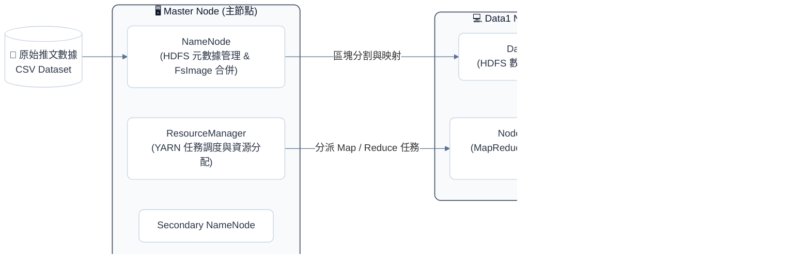

# 川普推文議題演變、情緒與社群影響力分析 (Trump Tweets Multi-Dimensional Analysis)

[](#)
[](#)
[](#)
[](#)

> **課程專題**：巨量資料分析 (Big Data Analytics)  
> **專案小組成員**：簡偉玲、黃鈺方、廖冠筑、徐澄澄  
> **個人核心職責**：Hadoop 雙節點運算架構規劃、Java MapReduce 數據清洗與分散式平行聚合腳本撰寫、多維度交叉統計分析

---

## 📌 專案背景與核心挑戰 (Introduction)
社群媒體已成為當代政治溝通與輿論動員的核心場域。本專案以 **Donald J. Trump 於 2020 至 2025 年間的推文數據（總計 44,500 則貼文、逾 12 億次互動）** 為分析對象，探討重大政治事件前後的議題演變、情緒傾向及其對社群互動（Likes / Retweets）的驅動關係。

### 🛠️ 技術挑戰
1. **半結構化社群文本清洗**：處理包含逗號、換行與引號包覆的非結構化推文內容，自動過濾異常與髒資料。
2. **多維度矩陣聚合**：需跨「時間（24 個季度）」、「8 大政策議題」與「3 類情緒極性」進行大規模統計與互動指標加總。

---

## 🏗️ 雙節點分散式運算架構 (Cluster Architecture)

本專案於 Linux 環境搭建雙節點 Hadoop 集群，透過 HDFS 區塊分散存儲與 YARN 資源排程，達成平行運算加速：



---

## ⚙️ MapReduce 平行處理演算法設計

針對巨量文本分析，設計兩階段 MapReduce 處理流水線：

### 1. Mapper 階段（資料清洗、特徵萃取與維度映射）
* **正則分詞解析**：使用正則表達式 `,(?=(?:[^\"]*\"[^\"]*\")*$)` 排除推文內含逗號之切分錯誤，並跳過表頭。
* **時間窗口切分**：提取年月日並映射至 2020_Q1 ~ 2025_Q4 共 24 個季度區間。
* **政策議題分類**：透過詞根匹配將貼文自動歸納入 8 大政策維度（移民、經濟、貿易、外交國安、公衛、選舉、司法、媒體）。
* **文字情緒極性識別**：比對指定關鍵詞集標註 Positive、Negative 或 Neutral。
* **鍵值對輸出 (Key-Value Output)**：
  * **Key**: `季度, 議題, 情緒`（如 `2020_Q4, Election, Negative`）
  * **Value**: `1, 按讚數 (Favorites), 轉發數 (Retweets)`

### 2. Reducer 階段（分散式加總統計）
* 自動捕獲並忽略數值解析異常之髒資料。
* 依 Key 分組累計總推文量、總按讚數與總轉發量，最終輸出 502 組高維度交叉矩陣。

```java
// Reducer 核心加總邏輯 (Java)
public void reduce(Text key, Iterable<Text> values, Context context) throws IOException, InterruptedException {
    long totalTweets = 0, totalFavorites = 0, totalRetweets = 0;
    for (Text val : values) {
        String[] parts = val.toString().split(",");
        try {
            totalTweets += Long.parseLong(parts[0]);
            totalFavorites += parts.length > 1 ? Long.parseLong(parts[1]) : 0;
            totalRetweets += parts.length > 2 ? Long.parseLong(parts[2]) : 0;
        } catch (NumberFormatException e) { /* 忽略格式異常資料 */ }
    }
    resultValue.set(totalTweets + "," + totalFavorites + "," + totalRetweets);
    context.write(key, resultValue);
}
```
*(上述 Reducer 邏輯對應於專案原始實作)*

---

## 📈 核心研究問題與資料洞察 (Key Insights)

### Q1. 推文議題如何隨重大政治事件演變？
分析顯示推文議題的轉移與真實政局高度連動：
* **2020 Q1～Q2**：COVID-19 爆發，**公共衛生（Public Health）** 成為最核心討論主題。
* **2020 Q3～Q4**：大選進入白熱化與選後爭議，**選舉議題（Election）** 推文量衝上單季 643 則歷史高峰。
* **2021**：受社群平台停權影響，貼文數據出現斷崖式萎縮（全年僅 156 則）。
* **2024～2025**：重返選戰與再任期間，焦點顯著轉向 **邊境移民（Immigration）** 與 **國家安全（Security）**。

| 季度議題演變時序趨勢圖 | LDA 主題模型核心詞彙分佈 |
| :---: | :---: |
| |  |
| 清楚呈現大選峰值、平台停權斷層與後期焦點轉移| 透過無監督 LDA 提取出「選舉邊境」、「選民動員」、「媒體批評」與「個人形象」四大主題 |

---

### Q2. 不同政策議題的情緒偏向是否存在差異？
統計 8 大議題的情緒分佈（排除 Neutral 後）：
* **批評力道最強（最負向）**：**媒體與政治傳播 (Media)** 負向比例最高達 **28.41%**，主要充斥對主流新聞台（Fake News / CNN）的抨擊。
* **訴求凝聚力最強（最正向）**：**移民與邊境 (Immigration)** 正向比例達 **37.64%**，頻繁結合 `Great`、`American` 等強烈民族認同詞彙。
* **Election（選舉）** 雖然總推文量最多（4,271 則），但負向佔比並非最高，顯示高討論量議題並不等同於極端負面情緒。

---

### Q3. 哪種「議題 × 情緒」組合最具社群擴散影響力？
以**平均互動數（Likes + Retweets）** 分析傳播效率：

| 排名 | 政策議題 (Topic) | 情緒傾向 (Sentiment) | 推文樣本數 | 平均 Likes | 平均 Retweets | 平均總互動數 |
| :---: | :--- | :---: | :---: | :---: | :---: | :---: |
| 🥇 **1** | **公共衛生 (Public Health)** | **Negative** | 35 | 83,228 | 23,215 | **106,443** |
| 🥈 2 | 公共衛生 (Public Health) | Positive | 101 | 77,204 | 17,692 | 94,896 |
| 🥉 3 | 貿易政策 (Trade) | Negative | 94 | 60,241 | 15,036 | 75,277 |
| 4 | 媒體傳播 (Media) | Negative | 441 | 54,502 | 14,312 | 68,814 |
| 5 | 選舉制度 (Election) | Negative | 789 | 46,162 | 11,819 | 57,981 |

*(上述數據完整反映高情緒張力在社群上的高擴散力)*

> 💡 **核心結論**：**「互動效率最高的往往不是貼文最多的議題」**。在公共衛生、貿易與媒體等高爭議性政策中，**負向情緒所激發的平均轉發與按讚數顯著高於正向與中立發文**，印證了社群演算法在爭議情緒下的放大效應。

| 推文情緒極性分佈圓餅圖 | DTM 關鍵詞強度熱力圖 (Keyword Heatmap) |
| :---: | :---: |
|  |  |
| 正向推文佔 44%，負向佔 21.6% | 透過連續推文分析核心詞彙聚類強度|
